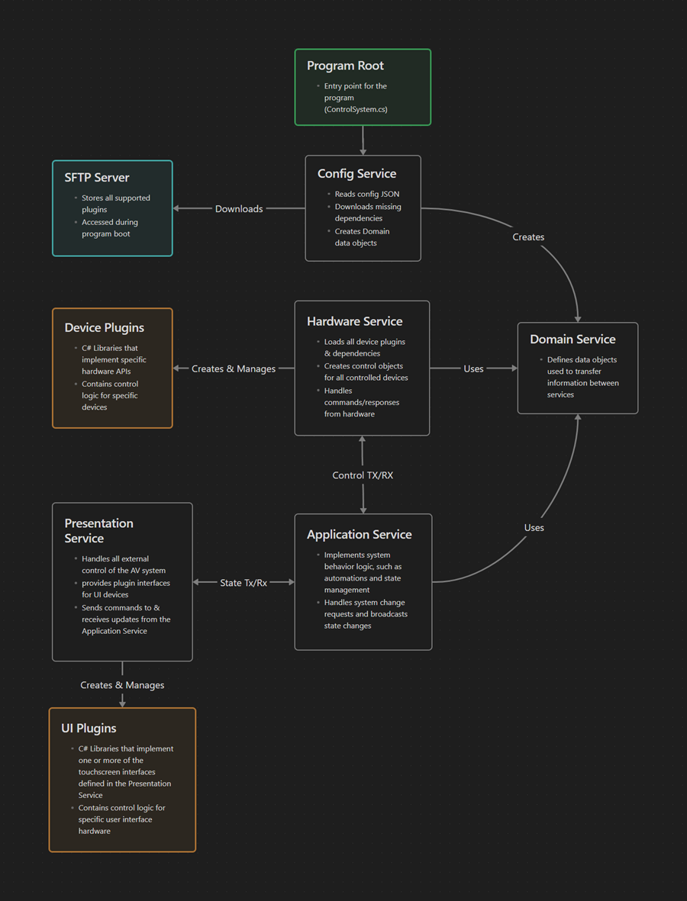

# GCU AV Framework Documentation

The GCU AV Framework (GCU-AVF) is a layered Crestron control system library for managing AV equipment in campus environments. The framework is divided into seven projects, each responsible for a distinct layer of the system.

---

## Projects

### [gcu-avf](gcu-avf/README.md) *(Entry Point)*

The main control system program. Contains the `ControlSystem` class that bootstraps the entire framework — loading room configuration, instantiating each service layer in order, connecting all hardware devices, and disposing services on program shutdown. This is the only project that produces a runnable Crestron program; all other projects are libraries consumed by it.

---

### [gcu-common-utils](gcu-common-utils/README.md)

Shared utility library used across all other projects. Provides the logging system (`Logger`), generic event argument types (`GenericSingleEventArgs`, `GenericDualEventArgs`, etc.), input validation helpers (`ParameterValidator`), and the `DriverLoader` plugin-loading utility used to instantiate extension classes at runtime.

---

### [gcu-config-service](gcu-config-service/README.md)

Responsible for locating and parsing the room configuration JSON file at program startup. Verifies that all referenced plugin `.dll` and `.sgd` files are present on the control processor and downloads any missing files via SFTP before raising `ConfigLoadComplete`. Produces the `IDomainService` object consumed by all other framework layers.

---

### [gcu-domain-service](gcu-domain-service/README.md)

Defines the configuration data model for the framework. Contains all data transfer objects (DTOs) that represent room settings, AV sources, destinations, displays, audio channels, lighting, transport devices, user interfaces, and more. These objects are populated by `gcu-config-service` at startup and consumed by the hardware and application layers.

---

### [gcu-hardware-service](gcu-hardware-service/README.md)

The hardware abstraction layer. Contains interfaces and concrete driver classes for all supported Crestron and third-party AV devices — displays, AV switchers/routers, DSPs, cameras, lighting controllers, relay endpoints, transport devices (Blu-ray, cable TV), and video wall processors. The `InfrastructureServiceFactory` creates and wires all hardware drivers from the domain configuration.

---

### [gcu-application-service](gcu-application-service/README.md)

The application control layer that sits between the hardware service and the user interface layer. Aggregates all hardware subsystems into a unified `IApplicationService` interface covering system power, display control, audio routing, AV routing, camera control, lighting, transport devices, endpoint relays, and video walls. Plugin authors extend `ApplicationService` to customize behavior without modifying the core framework.

---

### [gcu-ui-service](gcu-ui-service/README.md)

The presentation layer. Manages all user interface plugin connections, bridges application service state changes to the UI hardware, and handles Crestron Fusion server integration for remote monitoring and control. The `PresentationServiceFactory` loads UI plugins at runtime from the room configuration. Plugin authors implement `IUserInterface` to create custom touch panel interfaces.

---

## Layer Diagram



```
┌─────────────────────────────────────┐
│              gcu-avf                │  ← Entry point / bootstrapper
├─────────────────────────────────────┤
│          gcu-ui-service             │  ← Touch panels, Fusion server
├─────────────────────────────────────┤
│      gcu-application-service        │  ← Business logic / state management
├─────────────────────────────────────┤
│       gcu-hardware-service          │  ← Device drivers / hardware abstraction
├─────────────────────────────────────┤
│        gcu-domain-service           │  ← Configuration data model
│        gcu-config-service           │  ← Configuration file parsing + dependency download
├─────────────────────────────────────┤
│         gcu-common-utils            │  ← Shared utilities (all layers)
└─────────────────────────────────────┘
```
