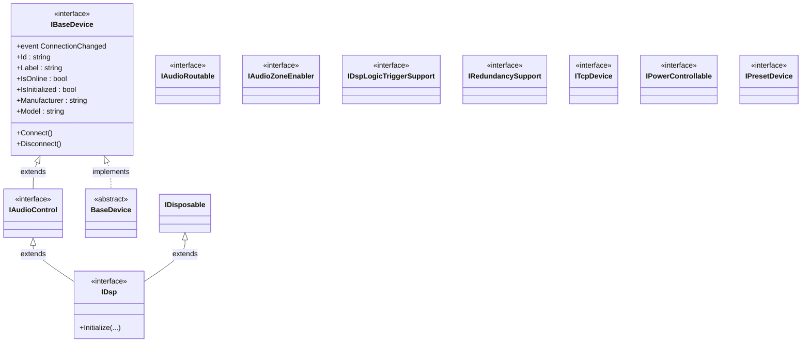

# GCU AV Framework — API Surface Reference for FrameworkStubs

> **Purpose.** This document is the source of truth for building a `FrameworkStubs` assembly that mirrors the public API surface of the real `gcu_hardware_service`, `gcu_common_utils`, and (where unavoidable) `gcu_domain_service` NuGet packages. Every signature, namespace, and inheritance edge below is copied verbatim from the markdown specs in `framework-docs/`. The stubs must throw `NotImplementedException` for any non-trivial behavior; only auto-property storage and ctor parameter assignment are allowed without a throw.
>
> **Scope.** The `QscDspTcp` plugin we are building must compile against this API as if the real DLLs were present. At delivery time, the real DLLs replace the stub assembly; if a signature here is wrong, integration will break.
>
> **C# language target.** .NET 8 / C# 12. The framework specs use:
> - C# 12 primary constructors (e.g. `class GenericSingleEventArgs<T>(T arg) : EventArgs`)
> - Nullable reference types (e.g. `event EventHandler<...>? Foo`)
> - `init`-only setters on `TcpClientWrapper`
> - Default parameter values in interface and constructor signatures
>
> The stubs MUST preserve these features so the consuming plugin compiles identically against stubs and against the real DLLs.

---

## Table of Contents

1. [Namespace Map](#1-namespace-map)
2. [Inheritance & Implementation Graph](#2-inheritance--implementation-graph)
3. [Per-Type API Surface — gcu_common_utils](#3-per-type-api-surface--gcu_common_utils)
4. [Per-Type API Surface — gcu_hardware_service](#4-per-type-api-surface--gcu_hardware_service)
5. [Per-Type API Surface — gcu_domain_service (referenced types only)](#5-per-type-api-surface--gcu_domain_service-referenced-types-only)
6. [Required QscDspTcp Implementation Surface](#6-required-qscdsptcp-implementation-surface)
7. [Logger API Quick Reference](#7-logger-api-quick-reference)
8. [BasicTcpClient API Quick Reference](#8-basictcpclient-api-quick-reference)
9. [Generic Event-Args Quick Reference](#9-generic-event-args-quick-reference)
10. [Open Questions & Stub Decisions](#10-open-questions--stub-decisions)

---

## 1. Namespace Map

Every type the plugin will touch and the namespace it lives in. Note that each "logical group" inside `gcu_hardware_service` is its own sub-namespace — this is critical: `IBaseDevice` and `BaseDevice` are NOT in `gcu_hardware_service` proper; they live in `gcu_hardware_service.BaseDevice`.

### gcu_common_utils

| Namespace | Types |
|-----------|-------|
| `gcu_common_utils.DataObjects` | `ListBuffer<T>`, `Vector2D` |
| `gcu_common_utils.FileOps` | `DirectoryHelper`, `DriverLoader` |
| `gcu_common_utils.GenericEventArgs` | `GenericSingleEventArgs<T>`, `GenericDualEventArgs<T1,T2>`, `GenericTrippleEventArgs<T1,T2,T3>` (note the spelling — `Tripple` with two p's, as documented) |
| `gcu_common_utils.IrComs` | `IIrPort`, `CrestronIrPort` |
| `gcu_common_utils.Logging` | `Logger` |
| `gcu_common_utils.Logging.LoggingTypes` | `LogServiceTypes` (enum), `LogDeviceTypes` (enum) |
| `gcu_common_utils.NetComs` | `BasicTcpClient`, `BasicFtpClient`, `TcpClientWrapper`, `WakeOnLan` |
| `gcu_common_utils.SerialComs` | `ISerialPort`, `CrestronComPort`, `CrestronComSpecHelper` |
| `gcu_common_utils.Validation` | `DataFormatter`, `ParameterValidator` |

### gcu_hardware_service

| Namespace | Types |
|-----------|-------|
| `gcu_hardware_service` | `ICrestronDevice`, `IInfrastructureService`, `InfrastructureService`, `InfrastructureServiceFactory` |
| `gcu_hardware_service.BaseDevice` | `IBaseDevice`, `BaseDevice` (abstract class), `DeviceContainer<T>` |
| `gcu_hardware_service.Communication` | `ITcpDevice`, `ISerialDevice`, `IIrDevice`, `IWakeOnLanDevice` |
| `gcu_hardware_service.PowerControl` | `IPowerControllable` |
| `gcu_hardware_service.Redundancy` | `IRedundancySupport` (the README also aliases this to `IBackupSupport` — see Open Questions) |
| `gcu_hardware_service.Routable` | `IAudioRoutable`, `IVideoRoutable` |
| `gcu_hardware_service.AudioDevices` | `IAudioControl`, `IDsp`, `IAudioZoneEnabler`, `IDspLogicTriggerSupport` |
| `gcu_hardware_service.AvSwitchDevices` | `IAvSwitcher`, `IVideoInputSyncDevice`, `AvSwitchCommands` (enum) |
| `gcu_hardware_service.AvIpMatrix` | `IAvIpMatrix`, `IAvIpEndpoint`, `AvIpEndpointTypes` (enum) |
| `gcu_hardware_service.CameraDevices` | `ICameraDevice`, `IPanTiltDevice`, `IZoomDevice`, `IPresetDevice`, `CameraPreset` |
| `gcu_hardware_service.DisplayDevices` | `IDisplayDevice`, `IVideoBlankDevice`, `IVideoFreezeDevice`, `ISupportsHoursUsed`, `IChannelControlDevice`, `CcdDisplayDevice` |
| `gcu_hardware_service.EndpointDevices` | `IEndpointDevice`, `IRelayDevice`, `ISerialEndpoint`, `IIrEndpoint`, `ProcessorEndpoint`, `C2NIoRelayDevice`, `CenIoRy401RelayDevice` |
| `gcu_hardware_service.LightingDevices` | `ILightingDevice` |
| `gcu_hardware_service.TransportDevices` | `ITransportDevice`, `IPlaybackTransports`, `IChannelTransports`, `IColorButtonTransports`, `IDigitalCableTransports` |
| `gcu_hardware_service.VideoWallDevices` | `IVideoWallDevice`, `VideoWallCanvas`, `VideoWallLayout`, `VideoWallCell` |

### gcu_domain_service (only the bits the plugin sees)

| Namespace | Types |
|-----------|-------|
| `gcu_domain_service` | `IDomainService` |
| `gcu_domain_service.Data` | `BaseData` |
| `gcu_domain_service.Data.ConnectionData` | `Connection`, `Authentication`, `ComSpec` |
| `gcu_domain_service.Data.DspData` | `Dsp`, `Channel`, `Preset` (file `DspPreset.md`), `LogicTrigger`, `ZoneEnableToggle` |

> **Note on file/folder spelling.** Doc paths use kebab-case (`gcu-hardware-service`) but the C# namespace uses snake_case (`gcu_hardware_service`). The doc explicitly says so at the top of every file.

---

## 2. Inheritance & Implementation Graph

### 2.1 Common-utils types — no notable hierarchy

- `GenericSingleEventArgs<T>`, `GenericDualEventArgs<T1,T2>`, `GenericTrippleEventArgs<T1,T2,T3>` all inherit from `System.EventArgs`.
- `BasicTcpClient`, `BasicFtpClient`, `TcpClientWrapper` all implement `System.IDisposable`.
- `Logger`, `ParameterValidator`, `DataFormatter` are static classes.

### 2.2 Hardware-service interface chain (Mermaid)



**Key fact:** `IDsp` extends BOTH `IAudioControl` AND `System.IDisposable` (per `IDsp.md` line 5).
`IAudioControl` extends `IBaseDevice` (per `IAudioControl.md` line 5).
Therefore `IDsp` transitively requires every member of `IBaseDevice` + `IAudioControl` + `IDisposable` + its own `Initialize`.

The other interfaces relevant to QscDspTcp (`IAudioRoutable`, `IAudioZoneEnabler`, `IDspLogicTriggerSupport`, `IRedundancySupport`, `ITcpDevice`, `IPowerControllable`) are **standalone** — none of them extends `IBaseDevice`. They contribute purely additive members. (See Open Questions about whether the real `IPresetDevice` is intended to extend `IBaseDevice`; the doc says "Implements:" nothing.)

### 2.3 What QscDspTcp must implement (transitively)

Reading the spec:
- The plugin is a DSP, so it implements `IDsp` (mandatory).
- The plugin uses TCP, so it implements `ITcpDevice`.
- The plugin extends `BaseDevice` (gives us `IBaseDevice` for free + `NotifyOnlineStatus()` helper).
- Per the spec the plugin also opts into `IAudioRoutable`, `IAudioZoneEnabler`, `IDspLogicTriggerSupport`, `IRedundancySupport`, and `IPowerControllable`.

Final required class signature:

```csharp
public class QscDspTcp
    : BaseDevice,
      IDsp,                         // brings IAudioControl + IDisposable
      ITcpDevice,
      IAudioRoutable,
      IAudioZoneEnabler,
      IDspLogicTriggerSupport,
      IRedundancySupport,
      IPowerControllable
```

(`IBaseDevice` is satisfied by inheriting `BaseDevice`. `IAudioControl` and `IDisposable` are satisfied by implementing `IDsp`. The compiler enforces all members listed below in §6.)

---

## 3. Per-Type API Surface — gcu_common_utils

### 3.1 `GenericSingleEventArgs<T>`
**Namespace:** `gcu_common_utils.GenericEventArgs`
**Inherits:** `System.EventArgs`
```csharp
public class GenericSingleEventArgs<T>(T arg) : EventArgs
{
    /// <summary>Gets a value representing the data sent during the event.</summary>
    public T Arg { get; }
}
```
Uses C# 12 primary constructor; `Arg` is initialized from `arg`. Getter only (no public setter).

### 3.2 `GenericDualEventArgs<T1, T2>`
**Namespace:** `gcu_common_utils.GenericEventArgs`
**Inherits:** `System.EventArgs`
```csharp
public class GenericDualEventArgs<T1, T2>(T1 arg1, T2 arg2) : EventArgs
{
    /// <summary>Gets the first data object supplied when the event was thrown.</summary>
    public T1 Arg1 { get; }
    /// <summary>Gets the second data object supplied when the event was thrown.</summary>
    public T2 Arg2 { get; }
}
```

### 3.3 `GenericTrippleEventArgs<T1, T2, T3>`
**Namespace:** `gcu_common_utils.GenericEventArgs`
**Inherits:** `System.EventArgs`
> **Spelling alert:** The class is `Tripple` with two p's, per the source doc. Mirror exactly.
```csharp
public class GenericTrippleEventArgs<T1, T2, T3>(T1 arg1, T2 arg2, T3 arg3) : EventArgs
{
    public T1 Arg1 { get; }
    public T2 Arg2 { get; }
    public T3 Arg3 { get; }
}
```

### 3.4 `Logger` (static)
**Namespace:** `gcu_common_utils.Logging`
```csharp
public static class Logger
{
    /// <summary>true = logging has been enabled and configured.</summary>
    public static bool IsInitialized { get; }

    /// <summary>Trigger internal logging system setup. Default programId = "".</summary>
    public static void Initialize(CrestronControlSystem controlSystem, string programId = "");

    /// <summary>Lowers the logging level to Debug.</summary>
    public static void EnableDebug();

    /// <summary>Sets the logging level back to a minimum of Warning.</summary>
    public static void DisableDebug();

    /// <summary>Closes and flushes all internal logging.</summary>
    public static void Destroy();

    /// <summary>Write a simple error message to all sinks.</summary>
    public static void Error(LogServiceTypes service, LogDeviceTypes device, string id, string message);

    /// <summary>Writes an exception to all sinks (message + stack trace).</summary>
    public static void Error(LogServiceTypes service, LogDeviceTypes device, string id, Exception exception);

    /// <summary>Writes a simple warning message.</summary>
    public static void Warn(LogServiceTypes service, LogDeviceTypes device, string id, string message);

    /// <summary>Writes a simple notice (informational) message.</summary>
    public static void Notice(LogServiceTypes service, LogDeviceTypes device, string id, string message);

    /// <summary>Writes a simple debug message (only if debug enabled).</summary>
    public static void Debug(LogServiceTypes service, LogDeviceTypes device, string id, string message);
}
```

> **Important:** The method names are `Error / Warn / Notice / Debug` — **NOT** `LogError / LogWarning / LogInfo`. The brief in the work order suggested the latter; the docs clearly say the former. We use the documented names.

### 3.5 `LogServiceTypes` (enum)
**Namespace:** `gcu_common_utils.Logging.LoggingTypes`
```csharp
public enum LogServiceTypes
{
    ControlSystem,
    Common,
    Configuration,
    Domain,
    Hardware,
    Application,
    Presentation,
    UiPlugin
}
```
> Underlying integer values are not specified in the docs; use default ascending from 0.

### 3.6 `LogDeviceTypes` (enum)
**Namespace:** `gcu_common_utils.Logging.LoggingTypes`
```csharp
public enum LogDeviceTypes
{
    NotApplicable,
    Display,
    Avr,
    Dsp,
    Ctv,
    Bluray,
    VideoWall,
    Lighting,
    Camera,
    Endpoint,
    UserInterface
}
```

### 3.7 `BasicTcpClient`
**Namespace:** `gcu_common_utils.NetComs`
**Implements:** `IDisposable`
```csharp
public class BasicTcpClient : IDisposable
{
    /// <summary>Initializes a new instance.</summary>
    /// <exception cref="ArgumentNullException">If hostname is null or empty.</exception>
    /// <exception cref="ArgumentException">If port outside 0-65535 or bufferSize less than 0.</exception>
    public BasicTcpClient(string hostname = "localhost", int port = 80, int bufferSize = 5000);

    // ── Events ───────────────────────────────────────────
    /// <summary>Triggered each time a connection attempt fails. Arg = SocketStatus enum value.</summary>
    public event EventHandler<GenericSingleEventArgs<SocketStatus>>? ConnectionFailed;

    /// <summary>Triggered on a successful connection with the host.</summary>
    public event EventHandler? ClientConnected;

    /// <summary>Triggered whenever the connection status changes.</summary>
    public event EventHandler? StatusChanged;

    /// <summary>Triggered whenever any data is received from the server (string).</summary>
    public event EventHandler<GenericSingleEventArgs<string>>? RxReceived;

    /// <summary>Triggered whenever any data is received from the server (byte[]).</summary>
    public event EventHandler<GenericSingleEventArgs<byte[]>>? RxBytesReceived;

    // ── Properties ───────────────────────────────────────
    /// <summary>The hostname or IP address set at object creation.</summary>
    public string Hostname { get; }

    /// <summary>The last set of data sent by the server as a string.</summary>
    public string RxData { get; }

    /// <summary>The most recent response from the server as bytes.</summary>
    public byte[] RxBytes { get; }

    /// <summary>The current connection status as a SocketStatus enum value.</summary>
    public SocketStatus ClientStatusMessage { get; }

    /// <summary>The port number being used for connection.</summary>
    public int Port { get; }

    /// <summary>The current buffer size used when sending or receiving.</summary>
    public int BufferSize { get; }

    /// <summary>True = client reports connected; false = disconnected.</summary>
    public bool Connected { get; }

    /// <summary>Whether the client should automatically attempt reconnect.</summary>
    public bool EnableReconnect { get; set; }

    /// <summary>Time between reconnect attempts in ms. Default 30000.</summary>
    public int ReconnectTime { get; set; }

    // ── Methods ──────────────────────────────────────────
    /// <summary>Attempt to connect to the server.</summary>
    public void Connect();

    /// <summary>Disconnect from the server if currently connected.</summary>
    public void Disconnect();

    /// <summary>Send a string of information to the server. Length limited by BufferSize. No-op if data is null.</summary>
    public void Send(string data);

    /// <summary>Send a command to the server as a byte array. No-op if data is empty.</summary>
    public void Send(byte[] data);

    /// <summary>Releases all resources. Disconnects and disposes the underlying TCPClient.</summary>
    public void Dispose();
}
```

> **Stub note on `SocketStatus`:** This is the Crestron `Crestron.SimplSharp.CrestronSockets.SocketStatus` enum. For the stub assembly we either (a) reference the Crestron NuGet (if present) or (b) define a tiny local stub `enum SocketStatus { SOCKET_STATUS_NO_CONNECT = 0, SOCKET_STATUS_CONNECTED = 2 }` in a `Crestron.SimplSharp.CrestronSockets` namespace. See Open Questions §10.

### 3.8 `TcpClientWrapper`
**Namespace:** `gcu_common_utils.NetComs`
**Implements:** `IDisposable`
> Not used by QscDspTcp directly per the spec, but stubbed for completeness because it is one of the "must mirror" types.
```csharp
public class TcpClientWrapper : IDisposable
{
    /// <summary>Defaults to 30 seconds.</summary>
    public TimeSpan ConnectionTimeout { get; set; }

    /// <summary>Defaults to "127.0.0.1". init-only.</summary>
    public string IpAddress { get; init; }

    /// <summary>Defaults to 80. init-only.</summary>
    public int Port { get; init; }

    public bool IsConnected { get; }

    public Func<TcpClientWrapper, Task>? OnConnectedCallback { get; init; }
    public Func<TcpClientWrapper, bool, Task>? OnDisconnectedCallback { get; init; }
    public Func<TcpClientWrapper, byte[], Task>? OnDataReceivedCallback { get; init; }
    public Action<TcpClientWrapper, string>? OnConnectionFailedCallback { get; init; }

    public Task ConnectAsync();
    public void Disconnect();
    /// <exception cref="ArgumentNullException">If data is null.</exception>
    public Task SendAsync(byte[] data, CancellationToken cancellationToken = default);
    public void Dispose();
}
```

### 3.9 `ParameterValidator` (static)
**Namespace:** `gcu_common_utils.Validation`
```csharp
public static class ParameterValidator
{
    /// <summary>Throws ArgumentNullException if param is null.</summary>
    public static void ThrowIfNull(object? param, string methodName, string paramName);

    /// <summary>Throws ArgumentException if param is null or empty.</summary>
    public static void ThrowIfNullOrEmpty(string param, string methodName, string paramName);
}
```
Exception message format (per docs):
- `ThrowIfNull` — `{methodName}() - {paramName} cannot be null.`
- `ThrowIfNullOrEmpty` — `{methodName}() - {paramName} cannot be null or empty.`

### 3.10 `DataFormatter` (static)
**Namespace:** `gcu_common_utils.Validation`
```csharp
public static class DataFormatter
{
    /// <summary>Strips leading/trailing whitespace and hyphens, uppercases via invariant culture.
    /// Returns string.Empty if arg is null or empty.</summary>
    public static string NormalizeDeviceModel(string arg);
}
```

### 3.11 `BasicFtpClient`
**Namespace:** `gcu_common_utils.NetComs`
**Implements:** `IDisposable`
> Not consumed by the plugin; included only because the work order says "stubbed full surface" — minimal stub is fine.
```csharp
public class BasicFtpClient : IDisposable
{
    /// <exception cref="ArgumentException">If any argument is null or empty.</exception>
    public BasicFtpClient(string host, string username, string password);

    /// <exception cref="ArgumentException">If host or username null/empty.</exception>
    /// <exception cref="ArgumentNullException">If sshKey is null.</exception>
    public BasicFtpClient(string host, string username, PrivateKeyFile sshKey);

    public event EventHandler<EventArgs>? FileQueryComplete;
    public event EventHandler<EventArgs>? ErrorOccurred;
    public event EventHandler<EventArgs>? DownloadComplete;

    public string LastErrorMessage { get; }
    public List<string> FilesNamesReceived { get; }
    public bool IsConnected { get; }

    public void Connect();
    public void Disconnect();
    /// <exception cref="ArgumentException">If remoteDirectory is null or empty.</exception>
    public void QueryFileNames(string remoteDirectory);
    /// <exception cref="ArgumentException">If either argument is null or empty.</exception>
    public void DownloadFile(string remoteFilePath, string localFilePath);
    public void Dispose();
}
```
> **Stub note on `PrivateKeyFile`:** `Renci.SshNet.PrivateKeyFile`. Either reference SSH.NET or stub it as a 1-line empty class in `Renci.SshNet` namespace.

---

## 4. Per-Type API Surface — gcu_hardware_service

### 4.1 `IBaseDevice`
**Namespace:** `gcu_hardware_service.BaseDevice`
```csharp
public interface IBaseDevice
{
    /// <summary>Notification for when the device connection has changed. Arg = device ID.</summary>
    event EventHandler<GenericSingleEventArgs<string>> ConnectionChanged;

    /// <summary>The unique ID of the device.</summary>
    string Id { get; }
    /// <summary>The user-friendly label of the device.</summary>
    string Label { get; }
    /// <summary>Whether the device is online.</summary>
    bool IsOnline { get; }
    /// <summary>Whether the device has been initialized and is ready to connect.</summary>
    bool IsInitialized { get; }
    /// <summary>The name of the company that created the device.</summary>
    string Manufacturer { get; set; }
    /// <summary>The specific device/hardware name used by the manufacturer.</summary>
    string Model { get; set; }

    /// <summary>Connect the communications protocol to the hardware.</summary>
    void Connect();
    /// <summary>Closes an active connection.</summary>
    void Disconnect();
}
```

> **Nullable annotation discrepancy:** `IBaseDevice.md` shows the event un-annotated (`event EventHandler<GenericSingleEventArgs<string>> ConnectionChanged`), whereas `BaseDevice.md` shows it nullable (`event EventHandler<GenericSingleEventArgs<string>>?`). Mirror the exact strings — interface = non-null, class = nullable. (See Open Questions §10.)

### 4.2 `BaseDevice` (abstract)
**Namespace:** `gcu_hardware_service.BaseDevice`
**Implements:** `IBaseDevice`
```csharp
public abstract class BaseDevice : IBaseDevice
{
    /// <summary>Notification for when the device connection has changed. Arg = device ID.</summary>
    public event EventHandler<GenericSingleEventArgs<string>>? ConnectionChanged;

    /// <summary>The unique ID. Defaults to string.Empty.</summary>
    public string Id { get; protected set; }
    /// <summary>User-friendly label. Defaults to string.Empty.</summary>
    public string Label { get; protected set; }
    /// <summary>Online status.</summary>
    public virtual bool IsOnline { get; protected set; }
    /// <summary>Initialization status.</summary>
    public virtual bool IsInitialized { get; protected set; }
    /// <summary>Manufacturer. Defaults to string.Empty.</summary>
    public string Manufacturer { get; set; }
    /// <summary>Model. Defaults to string.Empty.</summary>
    public string Model { get; set; }

    /// <summary>No-op base implementation; override in subclasses.</summary>
    public virtual void Connect();
    /// <summary>No-op base implementation; override in subclasses.</summary>
    public virtual void Disconnect();

    /// <summary>Method for notifying subscribers that the device online status has changed.</summary>
    protected virtual void NotifyOnlineStatus();
}
```

> **Implementation note for the stub:** because `Id` / `Label` / `IsOnline` / `IsInitialized` have `protected set`, sub-classes (like `QscDspTcp`) can write to them directly. The stub must preserve the exact accessor visibility.

### 4.3 `IAudioControl`
**Namespace:** `gcu_hardware_service.AudioDevices`
**Extends:** `IBaseDevice`
```csharp
public interface IAudioControl : IBaseDevice
{
    /// <summary>Triggered when a volume/level change is detected on any input. Arg1 = DSP ID, Arg2 = channel ID.</summary>
    event EventHandler<GenericDualEventArgs<string, string>> AudioInputLevelChanged;
    /// <summary>Triggered when a mute change is detected on any input. Arg1 = DSP ID, Arg2 = channel ID.</summary>
    event EventHandler<GenericDualEventArgs<string, string>> AudioInputMuteChanged;
    /// <summary>Triggered when a level change is detected on any output. Arg1 = DSP ID, Arg2 = channel ID.</summary>
    event EventHandler<GenericDualEventArgs<string, string>> AudioOutputLevelChanged;
    /// <summary>Triggered when a mute change is detected on any output. Arg1 = DSP ID, Arg2 = channel ID.</summary>
    event EventHandler<GenericDualEventArgs<string, string>> AudioOutputMuteChanged;

    /// <summary>IDs of all the presets added when the device was created.</summary>
    IEnumerable<string> GetAudioPresetIds();
    /// <summary>IDs of all input channels added when the device was created.</summary>
    IEnumerable<string> GetAudioInputIds();
    /// <summary>IDs of all output channels added when the device was created.</summary>
    IEnumerable<string> GetAudioOutputIds();

    /// <summary>Set the input channel level. 0–100 scaled internally.</summary>
    void SetAudioInputLevel(string id, int level);
    /// <summary>Query the current input audio level. Returns 0 if id not found.</summary>
    int GetAudioInputLevel(string id);
    /// <summary>Send a mute command to the input channel.</summary>
    void SetAudioInputMute(string id, bool mute);
    /// <summary>Get the input channel mute state. Returns false if id not found.</summary>
    bool GetAudioInputMute(string id);

    /// <summary>Set the output channel level. 0–100 scaled internally.</summary>
    void SetAudioOutputLevel(string id, int level);
    /// <summary>Query the current output audio level. Returns 0 if id not found.</summary>
    int GetAudioOutputLevel(string id);
    /// <summary>Send a mute command to the output channel.</summary>
    void SetAudioOutputMute(string id, bool mute);
    /// <summary>Get the output channel mute state. Returns false if id not found.</summary>
    bool GetAudioOutputMute(string id);

    /// <summary>Attempt to recall the target preset on the device.</summary>
    void RecallAudioPreset(string id);

    /// <summary>Add an input/microphone channel to the DSP.</summary>
    void AddInputChannel(
        string id,
        string levelTag,
        string muteTag,
        int bankIndex,
        int levelMax,
        int levelMin,
        int routerIndex,
        List<string> tags);

    /// <summary>Add an output channel to the DSP.</summary>
    void AddOutputChannel(
        string id,
        string levelTag,
        string muteTag,
        string routerTag,
        int routerIndex,
        int bankIndex,
        int levelMax,
        int levelMin,
        List<string> tags);

    /// <summary>Add a preset recall to the DSP.</summary>
    void AddPreset(string id, string bank, int index);
}
```

> **Param order alert:** `AddInputChannel` has params `(id, levelTag, muteTag, bankIndex, levelMax, levelMin, routerIndex, tags)` while `AddOutputChannel` is `(id, levelTag, muteTag, routerTag, routerIndex, bankIndex, levelMax, levelMin, tags)`. The order is **not** symmetrical — it matches the doc verbatim. Stubs and callers must mirror precisely.

### 4.4 `IDsp`
**Namespace:** `gcu_hardware_service.AudioDevices`
**Extends:** `IAudioControl`, `IDisposable`
```csharp
public interface IDsp : IAudioControl, IDisposable
{
    /// <summary>Sets internal object configuration. Does NOT connect.</summary>
    void Initialize(
        string hostId,
        int coreId,
        string hostname,
        int port,
        string username,
        string password);
}
```

### 4.5 `IAudioRoutable`
**Namespace:** `gcu_hardware_service.Routable`
```csharp
public interface IAudioRoutable
{
    /// <summary>Triggered when audio source for an output changes. Arg1 = device ID, Arg2 = output ID.</summary>
    event EventHandler<GenericDualEventArgs<string, string>> AudioRouteChanged;

    /// <summary>Returns the audio input ID currently routed to the output, or empty string on failure.</summary>
    string GetCurrentAudioSource(string outputId);
    /// <summary>Route the input to the output.</summary>
    void RouteAudio(string sourceId, string outputId);
    /// <summary>Clear all audio signals from the output.</summary>
    void ClearAudioRoute(string outputId);
}
```

### 4.6 `IAudioZoneEnabler`
**Namespace:** `gcu_hardware_service.AudioDevices`
```csharp
public interface IAudioZoneEnabler
{
    /// <summary>Arg1 = channel ID, Arg2 = zone toggle ID.</summary>
    event EventHandler<GenericDualEventArgs<string, string>> AudioZoneEnableChanged;

    /// <summary>Add a zone toggle to internal collection. Duplicate (channelId,zoneId) pairs are ignored.</summary>
    void AddAudioZoneEnable(string channelId, string zoneId, string controlTag);

    /// <summary>Remove a zone toggle. No-op if not found.</summary>
    void RemoveAudioZoneEnable(string channelId, string zoneId);

    /// <summary>Toggle the current state. No-op if not found.</summary>
    void ToggleAudioZoneEnable(string channelId, string zoneId);

    /// <summary>Discretely set whether a channel is mixed to a zone.</summary>
    void SetAudioZoneEnable(string channelId, string zoneId, bool enable);

    /// <summary>Query the current state of the zone enable. Returns false if not found.</summary>
    bool QueryAudioZoneEnable(string channelId, string zoneId);
}
```

### 4.7 `IDspLogicTriggerSupport`
**Namespace:** `gcu_hardware_service.AudioDevices`
```csharp
public interface IDspLogicTriggerSupport
{
    /// <summary>Triggered whenever a monitored trigger changes. Arg = trigger ID.</summary>
    event EventHandler<GenericSingleEventArgs<string>>? DspLogicTriggerStateChanged;

    /// <summary>Add a logic trigger control to the internal collection.</summary>
    void AddDspLogicTrigger(string id, string tagName, List<string> tags);

    /// <summary>Activate a logic trigger control on the DSP.</summary>
    void PulseDspLogicTrigger(string id);
}
```

> **Nullable annotation alert:** This event is the only `IDsp`-family event documented as nullable (`?`). Mirror exactly — `EventHandler<GenericSingleEventArgs<string>>?`.

### 4.8 `IRedundancySupport`
**Namespace:** `gcu_hardware_service.Redundancy`
> The README aliases this as `IBackupSupport`. The detail page calls it `IRedundancySupport`. We mirror **`IRedundancySupport`** as the canonical name.
```csharp
public interface IRedundancySupport
{
    /// <summary>Fired when implementation switches between primary and backup. Arg = device ID.</summary>
    event EventHandler<GenericSingleEventArgs<string>> RedundancyStateChanged;

    /// <summary>Fired when backup device gains/loses a connection. Arg = device ID.</summary>
    event EventHandler<GenericSingleEventArgs<string>> BackupDeviceConnectionChanged;

    /// <summary>true = primary connection is in use.</summary>
    bool PrimaryDeviceActive { get; }
    /// <summary>true = backup device is in use.</summary>
    bool BackupDeviceActive { get; }
    /// <summary>true = backup connection established.</summary>
    bool BackupDeviceOnline { get; }
    /// <summary>true = backup configured via SetBackupDeviceConnection().</summary>
    bool BackupDeviceExists { get; }

    /// <summary>Assign backup TCP info. Called after Initialize() and before Connect().</summary>
    void SetBackupDeviceConnection(string hostname, int port);
}
```

### 4.9 `ITcpDevice`
**Namespace:** `gcu_hardware_service.Communication`
```csharp
public interface ITcpDevice
{
    /// <summary>Set the TCP connection info. Called before Initialize() and Connect().</summary>
    void SetTcpConnectionInfo(string host, int port);
}
```

### 4.10 `IPowerControllable`
**Namespace:** `gcu_hardware_service.PowerControl`
```csharp
public interface IPowerControllable
{
    /// <summary>Triggered when the power state changes. Arg = device ID.</summary>
    event EventHandler<GenericSingleEventArgs<string>> PowerChanged;

    /// <summary>true = on; false = off/standby.</summary>
    bool PowerState { get; }

    /// <summary>Send a command to turn on.</summary>
    void PowerOn();
    /// <summary>Send a command to turn off/standby.</summary>
    void PowerOff();
}
```

### 4.11 `IPresetDevice`
**Namespace:** `gcu_hardware_service.CameraDevices`
> Documented under camera devices; the spec explicitly says it does NOT extend `IBaseDevice`. Listed here because the work order asked us to confirm it is independent. The QscDspTcp plugin does **not** implement this — DSPs use `IAudioControl.RecallAudioPreset` / `AddPreset` instead.
```csharp
public interface IPresetDevice
{
    /// <summary>true = device supports saving preset state from 3rd party.</summary>
    bool SupportsSavingPresets { get; }

    /// <summary>All presets configured on the hardware.</summary>
    ReadOnlyCollection<CameraPreset> QueryAllPresets();
    /// <summary>Update the internal preset collection.</summary>
    void SetPresetData(List<CameraPreset> presets);
    /// <summary>Recall a preset by ID.</summary>
    void RecallPreset(string id);
    /// <summary>Save the current state to the target preset (only if SupportsSavingPresets).</summary>
    void SavePreset(string id);
}
```

### 4.12 `ICrestronDevice`
**Namespace:** `gcu_hardware_service`
```csharp
public interface ICrestronDevice
{
    /// <summary>Assign the root Crestron control system to the plugin.</summary>
    void SetControlSystem(CrestronControlSystem controlSystem);
}
```

### 4.13 `ISerialDevice`, `IIrDevice`, `IWakeOnLanDevice`
**Namespace:** `gcu_hardware_service.Communication`

```csharp
public interface ISerialDevice
{
    /// <summary>Sets the internal com port used to send and receive data.</summary>
    void SetSerialControlPort(ISerialPort port);
}

public interface IIrDevice
{
    // (file referenced in README; not directly used by QscDspTcp — stub minimally)
}

public interface IWakeOnLanDevice
{
    /// <summary>Set Wake-On-LAN data. Defaults: broadcastAddress="255.255.255.255", broadcastPort=9.</summary>
    void SetWakeOnLanData(byte[] macAddress, string broadcastAddress = "255.255.255.255", uint broadcastPort = 9);
}
```

### 4.14 `IInfrastructureService`
**Namespace:** `gcu_hardware_service`
**Implements:** `IDisposable`
```csharp
public interface IInfrastructureService : IDisposable
{
    DeviceContainer<IAudioControl>     Dsps             { get; }
    DeviceContainer<IAvSwitcher>       AvSwitchers      { get; }
    DeviceContainer<IDisplayDevice>    Displays         { get; }
    DeviceContainer<IEndpointDevice>   Endpoints        { get; }
    DeviceContainer<ITransportDevice>  CableBoxes       { get; }
    DeviceContainer<ITransportDevice>  Blurays          { get; }
    DeviceContainer<ILightingDevice>   LightingDevices  { get; }
    DeviceContainer<IVideoWallDevice>  VideoWallDevices { get; }
    DeviceContainer<ICameraDevice>     CameraDevices    { get; }

    void AddDsp(Dsp dsp);
    void AddAudioChannel(Channel channel);
    void AddDisplay(Display display);
    void AddAvSwitch(MatrixData avSwitch, Routing routingData);
    void AddEndpoint(Endpoint endpointData);
    void AddCableBox(CableBox cableBox);
    void AddBluray(Bluray bluray);
    void AddLightingDevice(LightingInfo lightingDevice);
    void AddVideoWall(VideoWall videoWall);
    void AddCamera(Camera cameraData);
    void ConnectAllDevices();
}
```
> **Note:** The plugin doesn't implement `IInfrastructureService` (it is the host's responsibility), but the type appears in the namespace-map and is needed for the plugin's `dotnet test` harness if we mock it. Stub returns `NotImplementedException` everywhere.

### 4.15 `InfrastructureService`
**Namespace:** `gcu_hardware_service`
**Implements:** `IInfrastructureService`
```csharp
public class InfrastructureService : IInfrastructureService
{
    /// <exception cref="ArgumentNullException">If controlSystem is null.</exception>
    public InfrastructureService(CrestronControlSystem controlSystem);

    public DeviceContainer<IAudioControl>     Dsps             { get; }
    public DeviceContainer<IAvSwitcher>       AvSwitchers      { get; }
    public DeviceContainer<IDisplayDevice>    Displays         { get; }
    public DeviceContainer<IEndpointDevice>   Endpoints        { get; }
    public DeviceContainer<ITransportDevice>  CableBoxes       { get; }
    public DeviceContainer<ITransportDevice>  Blurays          { get; }
    public DeviceContainer<ILightingDevice>   LightingDevices  { get; }
    public DeviceContainer<IVideoWallDevice>  VideoWallDevices { get; }
    public DeviceContainer<ICameraDevice>     CameraDevices    { get; }

    public void AddDsp(Dsp dsp);
    public void AddAudioChannel(Channel channel);
    public void AddDisplay(Display display);
    public void AddAvSwitch(MatrixData avSwitch, Routing routingData);
    public void AddEndpoint(Endpoint endpointData);
    public void AddCableBox(CableBox cableBox);
    public void AddBluray(Bluray bluray);
    public void AddLightingDevice(LightingInfo lighting);   // note: param name "lighting" in concrete class, "lightingDevice" in interface
    public void AddVideoWall(VideoWall videoWall);
    public void AddCamera(Camera cameraData);
    public void ConnectAllDevices();
    public void Dispose();
}
```

### 4.16 `InfrastructureServiceFactory` (static)
**Namespace:** `gcu_hardware_service`
```csharp
public static class InfrastructureServiceFactory
{
    /// <summary>Create the infrastructure service. Does NOT establish device connections.</summary>
    /// <exception cref="ArgumentNullException">If domain or control are null.</exception>
    public static IInfrastructureService CreateInfrastructureService(IDomainService domain, CrestronControlSystem control);
}
```

### 4.17 `DeviceContainer<T>`
**Namespace:** `gcu_hardware_service.BaseDevice`
**Implements:** `IDisposable`
```csharp
public class DeviceContainer<T> : IDisposable
{
    /// <summary>Get the device by ID. Logs an error and returns default(T) if not found.</summary>
    /// <exception cref="ArgumentException">If id is null or empty.</exception>
    public T? GetDevice(string id);

    /// <summary>All currently stored devices.</summary>
    public ReadOnlyCollection<T> GetAllDevices();

    /// <summary>Check if a device exists.</summary>
    /// <exception cref="ArgumentException">If id is null or empty.</exception>
    public bool ContainsDevice(string id);

    /// <summary>Add a device. Replaces any existing device with the same ID.</summary>
    /// <exception cref="ArgumentException">If id is null or empty.</exception>
    /// <exception cref="ArgumentNullException">If device is null.</exception>
    public void AddDevice(string id, T device);

    /// <summary>Disposes all devices stored in the container that implement IDisposable.</summary>
    public void Dispose();
}
```
> No generic constraint is documented (`where T : ...`). We assume **none**. The use of `T?` on `GetDevice` requires the C# 8+ nullable-T behavior; with no constraint this resolves to `default(T)` semantics. Stubs should declare it as `public T? GetDevice(string id)` with the exact `?` annotation.

### 4.18 `IVideoRoutable`
**Namespace:** `gcu_hardware_service.Routable`
> Not implemented by QscDspTcp; included because it sits next to `IAudioRoutable` and the plugin may share a base.
```csharp
public interface IVideoRoutable
{
    /// <summary>Arg1 = device ID, Arg2 = output number.</summary>
    event EventHandler<GenericDualEventArgs<string, uint>> VideoRouteChanged;

    /// <summary>Returns the routed input number, or 0 on failure.</summary>
    uint GetCurrentVideoSource(uint output);
    void RouteVideo(uint source, uint output);
    void ClearVideoRoute(uint output);
}
```

### 4.19 `CameraPreset`
**Namespace:** `gcu_hardware_service.CameraDevices`
```csharp
public class CameraPreset
{
    /// <summary>A unique ID used to reference this preset.</summary>
    public string Id { get; set; }
    /// <summary>The camera-defined integer value for this preset.</summary>
    public int Number { get; set; }
}
```

---

## 5. Per-Type API Surface — gcu_domain_service (referenced types only)

The plugin doesn't construct domain types directly, but they appear in `IDsp.Initialize` arguments via the host, in `IInfrastructureService` method signatures, and in the per-test fixtures. We stub them as plain DTOs.

### 5.1 `BaseData`
**Namespace:** `gcu_domain_service.Data`
```csharp
public class BaseData
{
    public string Id { get; set; }           // = string.Empty
    public string Manufacturer { get; set; } // = string.Empty
    public string Model { get; set; }        // = string.Empty
}
```
> Not annotated as `abstract` in the docs — instantiate directly.

### 5.2 `Connection`
**Namespace:** `gcu_domain_service.Data.ConnectionData`
**Inherits:** `BaseData`
```csharp
public class Connection : BaseData
{
    public string Transport { get; set; }                 // = string.Empty ("tcp"|"ir"|"serial")
    public string Driver { get; set; }                    // = string.Empty
    public string Host { get; set; }                      // = string.Empty
    public string BackupHost { get; set; }                // = string.Empty
    public string MacAddress { get; set; }                // = string.Empty ("00.00.00.00.00.00")
    public int Port { get; set; }                         // = 0
    public int BackupPort { get; set; }                   // = 0
    public Authentication Authentication { get; set; }    // = new Authentication()
    public ComSpec ComSpec { get; set; }                  // = new ComSpec()
}
```

### 5.3 `Dsp`
**Namespace:** `gcu_domain_service.Data.DspData`
**Inherits:** `BaseData`
```csharp
public class Dsp : BaseData
{
    public int CoreId { get; set; }                          // = 0
    public List<string> Dependencies { get; set; }           // = new()
    public Connection Connection { get; set; }               // = new()
    public List<Preset> Presets { get; set; }                // = new()
    public List<LogicTrigger> LogicTriggers { get; set; }    // = new()
}
```

### 5.4 `Channel`
**Namespace:** `gcu_domain_service.Data.DspData`
**Inherits:** `BaseData`
```csharp
public class Channel : BaseData
{
    public string LevelControlTag { get; set; }                       // = string.Empty
    public string MuteControlTag { get; set; }                        // = string.Empty
    public string RouterControlTag { get; set; }                      // = string.Empty
    public string DspId { get; set; }                                 // = string.Empty
    public int RouterIndex { get; set; }                              // = 0
    public int BankIndex { get; set; }                                // = 0
    public string Label { get; set; }                                 // = string.Empty (shadows BaseData? no — BaseData has no Label; this is new)
    public string Icon { get; set; }                                  // = string.Empty
    public int LevelMax { get; set; }                                 // = 0
    public int LevelMin { get; set; }                                 // = 0
    public List<ZoneEnableToggle> ZoneEnableToggles { get; set; }     // = new()
    public List<string> Tags { get; set; }                            // = new()
}
```

### 5.5 `Preset` (DSP)
**Namespace:** `gcu_domain_service.Data.DspData` (file: `DspPreset.md`)
**Inherits:** `BaseData`
```csharp
public class Preset : BaseData
{
    public string Bank { get; set; }                  // = string.Empty
    public int Index { get; set; }                    // = 0
    public List<string> Tags;                          // public field, NOT property — per doc note
}
```
> The doc explicitly notes: "`Tags` is a public field (not a property) in the current implementation." Mirror exactly: `public List<string> Tags;` with no getter/setter.

### 5.6 `LogicTrigger`
**Namespace:** `gcu_domain_service.Data.DspData`
**Inherits:** `BaseData`
```csharp
public class LogicTrigger : BaseData
{
    public string Label { get; set; }            // = string.Empty
    public string TagName { get; set; }          // = string.Empty
    public List<string> Tags { get; set; }       // = new()
}
```

### 5.7 `ZoneEnableToggle`
**Namespace:** `gcu_domain_service.Data.DspData`
> **Does NOT inherit BaseData** per the doc — it has only `ZoneId`, `Label`, `Tag`.
```csharp
public class ZoneEnableToggle
{
    public string ZoneId { get; set; }   // = string.Empty
    public string Label { get; set; }    // = string.Empty
    public string Tag { get; set; }      // = string.Empty
}
```

### 5.8 `IDomainService`
**Namespace:** `gcu_domain_service`
> Plugin doesn't implement; tests may mock. Surface listed for completeness.
```csharp
public interface IDomainService
{
    ReadOnlyCollection<Display>       Displays       { get; }
    ReadOnlyCollection<Dsp>           Dsps           { get; }
    ReadOnlyCollection<Channel>       AudioChannels  { get; }
    ReadOnlyCollection<Camera>        Cameras        { get; }
    ReadOnlyCollection<LightingInfo>  Lighting       { get; }
    ReadOnlyCollection<UserInterface> UserInterfaces { get; }
    ReadOnlyCollection<Endpoint>      Endpoints      { get; }
    ReadOnlyCollection<Bluray>        Blurays        { get; }
    ReadOnlyCollection<CableBox>      CableBoxes     { get; }
    ReadOnlyCollection<VideoWall>     VideoWalls     { get; }
    FusionInfo  Fusion       { get; }
    Routing     RoutingInfo  { get; }
    RoomInfo    RoomInfo     { get; }
    ServerInfo  ServerInfo   { get; }

    Display       GetDisplay(string id);       // never returns null; empty Display if missing
    Dsp           GetDsp(string id);
    Camera        GetCamera(string id);
    LightingInfo  GetLightingInfo(string id);
    UserInterface GetUserInterface(string id);
    Endpoint      GetEndpoint(string id);
    Bluray        GetBluray(string id);
    CableBox      GetCableBox(string id);
    VideoWall     GetVideoWall(string id);
}
```
> The full surface of `Display`, `Camera`, `LightingInfo`, `UserInterface`, `Endpoint`, `Bluray`, `CableBox`, `VideoWall`, `Routing`, `MatrixData`, `Authentication`, `ComSpec`, `FusionInfo`, `RoomInfo`, `ServerInfo` is **out of scope** for QscDspTcp itself. Stub them as empty classes inheriting from `BaseData` where applicable, until a downstream test needs more.

---

## 6. Required QscDspTcp Implementation Surface

The plugin class must (publicly) expose every member below. Inherited members from `BaseDevice` are listed for reference but already provided by the base.

```csharp
public class QscDspTcp
    : BaseDevice,
      IDsp,
      ITcpDevice,
      IAudioRoutable,
      IAudioZoneEnabler,
      IDspLogicTriggerSupport,
      IRedundancySupport,
      IPowerControllable
{
    // ── from BaseDevice / IBaseDevice ────────────────
    // (inherited) event ConnectionChanged
    // (inherited) Id, Label, IsOnline, IsInitialized, Manufacturer, Model
    // override   Connect()
    // override   Disconnect()
    // protected  NotifyOnlineStatus()  // already virtual in base

    // ── from IAudioControl ───────────────────────────
    public event EventHandler<GenericDualEventArgs<string, string>> AudioInputLevelChanged;
    public event EventHandler<GenericDualEventArgs<string, string>> AudioInputMuteChanged;
    public event EventHandler<GenericDualEventArgs<string, string>> AudioOutputLevelChanged;
    public event EventHandler<GenericDualEventArgs<string, string>> AudioOutputMuteChanged;
    public IEnumerable<string> GetAudioPresetIds();
    public IEnumerable<string> GetAudioInputIds();
    public IEnumerable<string> GetAudioOutputIds();
    public void SetAudioInputLevel(string id, int level);
    public int  GetAudioInputLevel(string id);
    public void SetAudioInputMute(string id, bool mute);
    public bool GetAudioInputMute(string id);
    public void SetAudioOutputLevel(string id, int level);
    public int  GetAudioOutputLevel(string id);
    public void SetAudioOutputMute(string id, bool mute);
    public bool GetAudioOutputMute(string id);
    public void RecallAudioPreset(string id);
    public void AddInputChannel(string id, string levelTag, string muteTag, int bankIndex,
                                int levelMax, int levelMin, int routerIndex, List<string> tags);
    public void AddOutputChannel(string id, string levelTag, string muteTag, string routerTag,
                                 int routerIndex, int bankIndex, int levelMax, int levelMin, List<string> tags);
    public void AddPreset(string id, string bank, int index);

    // ── from IDsp ────────────────────────────────────
    public void Initialize(string hostId, int coreId, string hostname, int port, string username, string password);
    public void Dispose();   // from IDisposable

    // ── from ITcpDevice ──────────────────────────────
    public void SetTcpConnectionInfo(string host, int port);

    // ── from IAudioRoutable ──────────────────────────
    public event EventHandler<GenericDualEventArgs<string, string>> AudioRouteChanged;
    public string GetCurrentAudioSource(string outputId);
    public void   RouteAudio(string sourceId, string outputId);
    public void   ClearAudioRoute(string outputId);

    // ── from IAudioZoneEnabler ───────────────────────
    public event EventHandler<GenericDualEventArgs<string, string>> AudioZoneEnableChanged;
    public void AddAudioZoneEnable(string channelId, string zoneId, string controlTag);
    public void RemoveAudioZoneEnable(string channelId, string zoneId);
    public void ToggleAudioZoneEnable(string channelId, string zoneId);
    public void SetAudioZoneEnable(string channelId, string zoneId, bool enable);
    public bool QueryAudioZoneEnable(string channelId, string zoneId);

    // ── from IDspLogicTriggerSupport ─────────────────
    public event EventHandler<GenericSingleEventArgs<string>>? DspLogicTriggerStateChanged;
    public void AddDspLogicTrigger(string id, string tagName, List<string> tags);
    public void PulseDspLogicTrigger(string id);

    // ── from IRedundancySupport ──────────────────────
    public event EventHandler<GenericSingleEventArgs<string>> RedundancyStateChanged;
    public event EventHandler<GenericSingleEventArgs<string>> BackupDeviceConnectionChanged;
    public bool PrimaryDeviceActive { get; }
    public bool BackupDeviceActive  { get; }
    public bool BackupDeviceOnline  { get; }
    public bool BackupDeviceExists  { get; }
    public void SetBackupDeviceConnection(string hostname, int port);

    // ── from IPowerControllable ──────────────────────
    public event EventHandler<GenericSingleEventArgs<string>> PowerChanged;
    public bool PowerState { get; }
    public void PowerOn();
    public void PowerOff();
}
```

### 6.1 README "must implement" cross-check

The work order calls out the following must-implement list. Each item is mapped to its method here:

| README item | Mapped to |
|-------------|-----------|
| Required: implement `IDsp` | satisfied by §4.4 |
| Required: extend `BaseDevice` | satisfied by §4.2 |
| Required: implement `ITcpDevice` for TCP control | satisfied by §4.9 |
| Optional: `IAudioZoneEnabler` | §4.6 |
| Optional: `IDspLogicTriggerSupport` | §4.7 |
| Optional: `IAudioRoutable` (any audio routing) | §4.5 |
| Required: `IRedundancySupport` for backup core | §4.8 |
| Optional: `IPowerControllable` | §4.10 |
| MUST use `BasicTcpClient` | §3.7 — single instance per primary connection; second instance for backup |
| MUST log via `Logger` | §3.4 — every call site uses `LogServiceTypes.Hardware`, `LogDeviceTypes.Dsp` |
| MUST throw via `ParameterValidator` | §3.9 — at every public-method entry |

---

## 7. Logger API Quick Reference

```
Logger.Initialize(controlSystem, programId = "")
Logger.EnableDebug()  / Logger.DisableDebug()
Logger.Destroy()
Logger.IsInitialized

Logger.Error  (LogServiceTypes svc, LogDeviceTypes dev, string id, string msg)
Logger.Error  (LogServiceTypes svc, LogDeviceTypes dev, string id, Exception ex)
Logger.Warn   (LogServiceTypes svc, LogDeviceTypes dev, string id, string msg)
Logger.Notice (LogServiceTypes svc, LogDeviceTypes dev, string id, string msg)
Logger.Debug  (LogServiceTypes svc, LogDeviceTypes dev, string id, string msg)
```

For the QscDspTcp plugin, every call uses:
- `service = LogServiceTypes.Hardware`
- `device  = LogDeviceTypes.Dsp`
- `id      = this.Id` (or `"QscDspTcp"` before `Id` is set)

Severity mapping for the plugin:
- `Error` → exception caught, malformed response, IO failure
- `Warn`  → recoverable problem (channel not found, etc.)
- `Notice` → connection state changes, "device added"
- `Debug` → raw RX/TX traffic, parser internals (only when `setdebug ON`)

> The work order asked about "LogError / LogWarning / LogInfo". Those names do **not** exist in the framework. The correct names are `Error / Warn / Notice / Debug` (no "Log" prefix on the methods, since the class itself is `Logger`). See Open Questions §10.

---

## 8. BasicTcpClient API Quick Reference

```csharp
new BasicTcpClient(hostname = "localhost", port = 80, bufferSize = 5000)

// Events
ConnectionFailed   : EventHandler<GenericSingleEventArgs<SocketStatus>>?
ClientConnected    : EventHandler?                       // no payload
StatusChanged      : EventHandler?                       // read ClientStatusMessage
RxReceived         : EventHandler<GenericSingleEventArgs<string>>?
RxBytesReceived    : EventHandler<GenericSingleEventArgs<byte[]>>?

// Read-only props
Hostname, RxData, RxBytes, ClientStatusMessage, Port, BufferSize, Connected

// Read-write props
EnableReconnect : bool
ReconnectTime   : int  // ms; default 30_000

// Methods
void Connect()
void Disconnect()
void Send(string data)   // null = no-op
void Send(byte[] data)   // empty = no-op
void Dispose()
```

**For QscDspTcp:**
- One `BasicTcpClient` for the primary core, one for the backup (when configured).
- Subscribe to `RxReceived` for the QSC text protocol (newline-delimited).
- Subscribe to `ClientConnected` and `ConnectionFailed` to drive `IsOnline` / `BaseDevice.NotifyOnlineStatus()`.
- Set `EnableReconnect = true` and leave `ReconnectTime` at the default 30 s.
- Do NOT keep raw `byte[]` paths — QSC Q-SYS Remote Control Protocol (QRC) is text/JSON.

---

## 9. Generic Event-Args Quick Reference

```csharp
new GenericSingleEventArgs<T>(arg).Arg                           // single payload
new GenericDualEventArgs<T1,T2>(a1, a2).Arg1 / .Arg2             // two payloads
new GenericTrippleEventArgs<T1,T2,T3>(a1, a2, a3).Arg1/2/3       // three payloads (note Tripple)
```

All inherit from `EventArgs`. All properties are getter-only (set during ctor). The work order asked about "constructor signatures" — they are primary constructors:

```csharp
public class GenericSingleEventArgs<T>(T arg)            : EventArgs { public T Arg { get; } = arg; }
public class GenericDualEventArgs<T1,T2>(T1 arg1, T2 arg2)        : EventArgs
public class GenericTrippleEventArgs<T1,T2,T3>(T1 arg1, T2 arg2, T3 arg3) : EventArgs
```

Stub equivalence (also valid C# 12 — both forms compile to the same metadata):

```csharp
public class GenericSingleEventArgs<T> : EventArgs
{
    public T Arg { get; }
    public GenericSingleEventArgs(T arg) { Arg = arg; }
}
```

---

## 10. Open Questions & Stub Decisions

These are points where the docs are silent or contradictory. We list our default stub decision; ask before the real DLLs land if any of these matter.

### 10.1 Method-name confusion — `Logger.LogError` vs `Logger.Error`
- **Doc says:** `Error / Warn / Notice / Debug`.
- **Work order said:** "LogError, LogWarning, LogDebug, LogInfo".
- **Decision:** Use the documented names verbatim. If consumer code expects `LogError`, that's a bug we'll catch at first compile. (No "Info"-level method is documented at all — `Notice` is the closest equivalent.)

### 10.2 `IRedundancySupport` vs `IBackupSupport` aliasing
- The README link table says `IBackupSupport`, but the page itself is `IRedundancySupport`.
- **Decision:** Mirror **`IRedundancySupport`** as the canonical name (matches the actual file content + namespace `Redundancy`). If the real DLL exposes `IBackupSupport` as an alias, our plugin still implements the canonical type — so the alias would be additive.

### 10.3 Nullable-event annotations are inconsistent
- `IBaseDevice` shows `event EventHandler<...> ConnectionChanged` (non-nullable).
- `BaseDevice` shows `event EventHandler<...>? ConnectionChanged` (nullable).
- `IDspLogicTriggerSupport` shows the event nullable on the interface, but other interfaces show non-nullable.
- **Decision:** Mirror exactly per-doc — interfaces match what their `.md` says; `BaseDevice` has nullable. The plugin can declare its own events as nullable (`?`) regardless. Compatibility with the real DLL depends on its `[NullableContext]` attributes; plugin code should `?.Invoke(...)` defensively.

### 10.4 Generic constraint on `DeviceContainer<T>`
- No `where T : ...` clause in the docs.
- **Decision:** No constraint. `T?` works for both reference and value types in C# 8+ via the `[MaybeNull]` attribute the compiler emits. Stub returns `default(T)`.

### 10.5 `Dispose()` behavior on `BaseDevice`
- The doc does not say `BaseDevice` itself implements `IDisposable`. But `IDsp` does. So `QscDspTcp` will need `Dispose()` defined; it cannot be inherited from `BaseDevice` unless `BaseDevice` already implements `IDisposable`.
- **Decision:** Treat `BaseDevice` as **not** `IDisposable`. Plugin implements `Dispose()` itself. Confirm against the real DLL — if `BaseDevice : IDisposable` exists, our `Dispose` is just a `public override`/`public new`.

### 10.6 `IPresetDevice` does NOT extend `IBaseDevice`
- The doc does not list any base interface.
- **Decision:** Stub it standalone. (Not used by QscDspTcp anyway.)

### 10.7 Default values for `Initialize` parameters on `IDsp`
- Doc says `coreId` "Can be set to 0 if unused" — implying caller-supplied default, no compiler default.
- **Decision:** No defaults in the interface signature. Caller must supply all six.

### 10.8 Exception types from `IAudioControl` / `IAudioZoneEnabler` / `IRedundancySupport` methods
- Docs describe behavior ("returns 0 if id not found", "no action taken if not found") but never specify thrown exception types beyond null-arg checks via `ParameterValidator`.
- **Decision:** Plugin uses `ParameterValidator.ThrowIfNullOrEmpty` at entry, then logs and returns the documented fallback (0 / `false` / `string.Empty`) for missing IDs. The stub assembly throws `NotImplementedException` for each method body.

### 10.9 `Tags` field-vs-property irregularity on `Preset`
- Doc explicitly says `Tags` on the `Preset` (DSP) class is a public **field**.
- **Decision:** Mirror the field declaration exactly. Note that several other domain classes (`Channel.Tags`, `LogicTrigger.Tags`, `Dsp.Dependencies`) are documented as **properties**. Only `Preset.Tags` is a field.

### 10.10 `SocketStatus` source
- `BasicTcpClient` references `SocketStatus`; this is `Crestron.SimplSharp.CrestronSockets.SocketStatus`.
- **Decision:** Have FrameworkStubs include either (a) a reference to the Crestron NuGet (`Crestron.SimplSharpPro.SDK` or similar — already a dependency for `CrestronControlSystem`), or (b) a tiny shim enum inside `Crestron.SimplSharp.CrestronSockets` namespace with the values needed for testing. Confirm with the user which dependency-management approach they want before delivery.

### 10.11 `CrestronControlSystem` — used widely
- Referenced by `Logger.Initialize`, `InfrastructureService` ctor, `InfrastructureServiceFactory`, `ICrestronDevice`. Lives in `Crestron.SimplSharpPro` namespace in the real Crestron SDK.
- **Decision:** Same as §10.10 — either reference the real Crestron SDK or stub a 1-line empty class in `Crestron.SimplSharpPro` namespace.

### 10.12 `MatrixData`, `Display`, `Camera`, `Endpoint`, `Bluray`, `CableBox`, `Routing`, `LightingInfo`, `VideoWall`, `Authentication`, `ComSpec`, `FusionInfo`, `RoomInfo`, `ServerInfo`, `UserInterface`
- Referenced by `IInfrastructureService` and `IDomainService` but not implemented by QscDspTcp.
- **Decision:** Stub each as empty classes inheriting `BaseData` (when documented) or empty class (when not). Add real properties only when downstream test code needs them.

### 10.13 Threading / re-entrancy
- The docs never discuss whether events are raised on Crestron's UI thread, a worker thread, or the caller's thread.
- **Decision:** Plugin must lock around shared state (`Dictionary<string, ChannelState>` etc.) and never assume single-threaded raise. Stub doesn't need to model threading.

### 10.14 `ParameterValidator` and `[CallerMemberName]`
- The doc takes `methodName` as an explicit string. It does not show `[CallerMemberName]` decoration.
- **Decision:** Stub with no `[CallerMemberName]` attribute; callers pass method name literally (e.g. `nameof(SetAudioInputLevel)`).

### 10.15 Nullability of `BaseDevice.Manufacturer`/`Model` (writeable)
- Doc shows `public string Manufacturer { get; set; }` (no `?`). Defaults to `string.Empty`.
- **Decision:** Plugin must initialize these to `string.Empty` in its constructor (or rely on `BaseDevice`'s default) — never `null`.

### 10.16 README line "DSP plugins MUST use BasicTcpClient"
- The work order asserts this; we couldn't find the explicit "MUST" sentence in the framework README — only in the project's plugin-author guidance which lives outside `framework-docs/`.
- **Decision:** Treat as a hard requirement (it matches Crestron-runtime constraints — `System.Net.Sockets.TcpClient` is restricted on the Crestron AppDomain). Plugin uses `BasicTcpClient`. Confirm with user if this is in fact in the spec.

---

## Appendix A — Type-by-type "stub-or-reference" matrix

For each type the stub assembly produces, indicate whether the body should be:
- **STORE** — auto-property storage / ctor assignment, no behavior
- **THROW** — body throws `NotImplementedException`
- **NOOP** — body is empty (returns default for non-void)

| Type | Strategy |
|------|----------|
| `GenericSingleEventArgs<T>` and siblings | STORE (primary ctor sets the prop) |
| `Logger.*` | THROW for Error/Warn/Notice/Debug; NOOP for `Initialize`/`Enable/Disable/Destroy`; `IsInitialized` returns false |
| `LogServiceTypes`, `LogDeviceTypes` | enum literal — no body |
| `BasicTcpClient` ctor | STORE properties; `Connect/Disconnect/Send/Dispose` THROW |
| `BasicTcpClient` events | declare; `Connect()` may raise `ConnectionFailed` immediately when stub-mode is enabled (optional convenience) |
| `TcpClientWrapper` | STORE init-only props; methods THROW |
| `ParameterValidator.*` | implement REAL behavior — these throw legitimately and are trivial to write |
| `DataFormatter.NormalizeDeviceModel` | implement REAL behavior — trivial string ops |
| `BaseDevice` (abstract) | STORE props; `Connect/Disconnect/NotifyOnlineStatus` NOOP virtual |
| `DeviceContainer<T>` | implement REAL backing `Dictionary<string, T>` so tests can use it |
| `InfrastructureService(Factory)` | THROW everywhere (plugin doesn't instantiate it) |
| Domain DTOs (`Dsp`, `Channel`, `Preset`, etc.) | STORE props with default values matching the docs |
| All hardware-service interfaces | declare only — interfaces have no bodies |

---

*End of FRAMEWORK_API_SURFACE.md*
